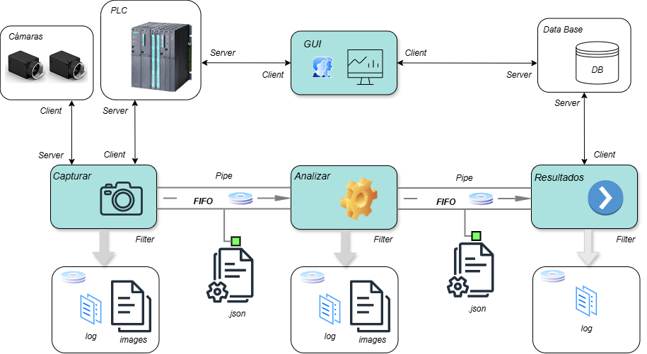

# Sistema de visión artificial para la inspección de la aplicación de cordones de masilla en un proceso industrial
Este trabajo forma parte del trabajo fin de estudios (**TFE**) del Grado en Ingeniería Informática de [**UNIR**](http://www.unir.net)
## Resumen 
El presente trabajo aborda un problema de inspección de calidad en un proceso de fabricación industrial real. La solución planteada consiste en un sistema de verificación automática de los cordones de masilla aplicados en las carrocerías para sellar el habitáculo interior, utilizando técnicas de visión artificial basadas en redes neuronales profundas.
Se propone una aplicación de segmentación semántica implementada mediante una arquitectura de red U-Net, que genera máscaras con las zonas de la imagen en las que se ha aplicado masilla. Posteriormente, otro algoritmo verifica si la masilla se encuentra correctamente ubicada, garantizando el adecuado sellado de las carrocerías. Para el entrenamiento del modelo, se ha utilizado un dataset propio, generado con imágenes de las cámaras de inspección, y debido al reducido volumen y a la escasa variabilidad de los datos, se han utilizado técnicas de data augmentation que han aportado robustez al sistema y han evitado el sobreajuste del modelo durante la fase de entrenamiento.
Los adecuados resultados obtenidos, con métricas (IoU=0,98) aunque preliminares, indican la viabilidad de la solución aportada y la robustez del sistema frente a diferentes condiciones de iluminación. La principal aportación de este trabajo radica en la aplicación práctica de técnicas de segmentación semántica a un problema real de inspección en la industria del automóvil, demostrando que es posible desarrollar este tipo de soluciones con medios propios de la empresa y alcanzar resultados satisfactorios.
## Índice
- [1. Requerimientos técnicos del software](#1-requerimientos-técnicos-del-software)
- [2. Estructura del proyecto](#2-estructura-del-proyecto)
- [3. Generación del dataset](#3-generación-del-dataset)
- [4. Entrenamiento del modelo U-Net](#4-entrenamiento-del-modelo-u-net)
- [5. Simulación](#5-simulación)
- [6. Resultado esperado](#6-resultado-esperado)

## 1. Requerimientos técnicos del software
- **Lenguaje y versión**: El software se ha desarrollado utilizando la versión de **Python 3.11.3**. No obstante para herramientas auxiliares como **Labelme** o **Albumentations**, se han empleado entornos adicionales con otras versiones. Se recomienda utilizar estas mismas versiones para asegurar la compatibilidad del sistema, aunque en algunos casos versiones anteriores también pueden ser válidas.
- **Entorno de ejecución**: Para el desarrollo de este trabajo se han utilizado diferentes entornos virtuales de **Anaconda**. Se ha utilizado un entorno principal para la ejecución general del sistema, pero por problema de compatibilidades de paquetes se han utilizados dos entornos virtuales más, uno para la herramienta **labelme** y otro para **Albumentations**. Se recomienda el uso de entornos virtuales (por ejemplo **Anaconda** o **venv**) que permitan instalar las dependencias necesarias para ejecutar el software.
- **Motor de la base de datos**: MySQL Community Server – GPL, versión 8.2.0
Aunque no es un requisito, para la pruebas se recomienda el uso de un contenedor **Docker** por su sencillez.

### Paso 1. Instalación del entorno principal
1. **Instalar Anaconda** desde el sitio oficial:
   [Descargar Anaconda](https://www.anaconda.com/download)

3. **Crear un entorno virtual y activarlo** (ejemplo con nombre `TFG`):  
    ~~~
   conda create -n TFG python=3.11.3
    ~~~
    ~~~
   conda activate TFG
    ~~~
2. **Instalar dependencias principales** (instalar individualmente via pip dentro del entorno):  
    ~~~
   pip install python-snap7==2.0.2
    ~~~
    ~~~
   pip install opencv-python==4.11.0.86
    ~~~
    ~~~
   pip install matplotlib==3.10.5
    ~~~
    ~~~
   pip install mysql-connector-python==9.4.0
    ~~~
    ~~~
   pip install python-dotenv==1.1.1
    ~~~
    ~~~
   pip install tensorflow==2.20.0
    ~~~

### Paso 2. Instalación del entorno de etiquetado de imágenes
1. **Crear un entorno virtual y activarlo** (ejemplo con nombre `etiquetado`):  
    ~~~
   conda create -n etiquetado python=3.8
    ~~~
    ~~~
   conda activate etiquetado
    ~~~
2. **Instalar dependencias necesarias** (instalar individualmente via pip dentro del entorno):
  
   **pyside2** (para la interfaz gráfica, instalado via conda-forge):
    ~~~
   conda install -c conda-forge pyside2
    ~~~
   **labelme** (instalado via pip):
    ~~~
   pip install labelme
    ~~~

### Paso 3. Instalación del entorno para data augmentation
1. **Crear un entorno virtual y activarlo** (ejemplo con nombre `albumentations`):  
    ~~~
   conda create -n albumentations python=3.8
    ~~~
    ~~~
   conda activate albumentations
    ~~~
2. **Instalar dependencias necesarias** (instalar individualmente via pip dentro del entorno):

   **albumentations** (instalado via pip):
    ~~~
   pip install albumentations
    ~~~
   **opencv-python** (versión completa: necesaria para soporte gráfico, evitando instalar opencv-python-headless):
    ~~~
   pip install opencv-python
    ~~~

### Paso 4. Instalación de la base de datos MySQL con Docker
1. **Descargar Docker Desktop desde la web oficial:**  
[Descargar Docker](https://www.docker.com)
2. **Descargar algún gestor de bases de datos**. Para este proyecto se ha utilizado **DataGrip de JetBrains**, pero se puede utilizar cualquier otro válido para **MySQL.**
   **Datagrip** se puede descargar desde la web oficial: 
[Descargar DataGrip](https://www.jetbrains.com/es-es/datagrip)
3. Ejecutar este comando para descargar la imagen **de MySQL versión 8.2**:
    ~~~
   docker pull mysql:8.2.0
    ~~~
4. Con el siguiente comando, **crear un contenedor** a partir de la imagen descargada que exponga el **puerto 3306** del contenedor en el **puerto 3306** de nuestra máquina local (puerto por defecto). A modo de ejemplo, el nombre del contenedor se pone como TFE y el password del usuario root: mysql (estos ajustes se pueden personalizar):
    ~~~
   docker run -p 3306:3306 --name TFE -e MYSQL_ROOT_PASSWORD=mysql -d mysql:8.2.0
    ~~~
5. Abrir el **gestor de base de datos**, **crear un nuevo schema** y **ejecutar en consola los scripts** que se encuentran en el directorio BBDD de este repositorio en este orden:
   - **Script DDL** genera las tablas y sus relaciones, además de crear un índice.
   - **Script DML** inserta los valores fijos de configuración necesarios antes de insertar datos desde el programa de resultados.

## 2. Estructura del proyecto
El flujo principal de este proyecto se divide en **3 programas independientes**:
1. Comunicación con el **PLC** y las **cámaras** para capturar imágenes de las carrocerías.  
2. Análisis de las imágenes y generación del resultado.  
3. Inserción del resultado en la **base de datos**.

Para implementar esta solución, la **arquitectura propuesta** se basa en un modelo de **tuberías y filtros** (pipes and filters), donde cada módulo se comporta como un filtro especializado y se conecta con los siguientes a través de **colas FIFO con persistencia en disco**. De esta forma, se desacoplan los procesos asegurando una mejor tolerancia a fallos si un proceso se detiene, los demás permanecen acumulando datos en la cola o esperando a recibirlos.

Por ello es importante **respetar la estructura de directorios** de este repositorio tal y como se indica a continuación, descargando el código completo y guardándolo en el equipo con la misma estructura. El directorio raiz se llama TFE a modo de ejemplo.

~~~
TFE/
├── Programs/
│   ├── AnalizadorFactory/    # Programa del analizador de imágenes
│   ├── Grabar_imagenes/      # Programa de grabación de imágenes
│   ├── Resultados/           # Programa de inserción en la BBDD
│   ├── Scripts/              # Herramientas auxiliares como la generación del dataset o el entrenamiento del modelo
├── data/                # La estructura data se genera sola si no existe.
│   ├── App/         
│   ├── ├── Local/         
│   ├── ├── ├── ordenes/        
│   ├── ├── ├── ├── fifo_analizar_resultados/          # Cola fifo de ficheros JSON entre analizar y resultados
│   ├── ├── ├── ├── fifo_analizar_resultados_fallos/   # Ficheros JSON con fallo en la cola FIFO analizar-resultados
│   ├── ├── ├── ├── fifo_grabar_analizar/              # Cola fifo de ficheros JSON entre grabar y analizar
│   ├── ├── ├── ├── fifo_grabar_analizar_fallos/       # Ficheros JSON con fallo en la cola FIFO grabar-analizar
├── images/              # Directorio de imágenes organizado en carpetas por año, mes, dia y número de pin de la carrocería.
│   ├── "año"/           # La estructura de images se genera sola si no existe.
│   ├── ├──  "mes"/
│   ├── ├── ├── "dia"/
│   ├── ├── ├── ├── "pin"/
├── logs/                # Directorio de logs organizado en carpetas por año, mes, y dia.
│   ├── "año"/           # La estructura de logs se genera sola si no existe.
│   ├── ├──  "mes"/
│   ├── ├── ├── "dia"/
│   ├── ├── ├── ├── "pin"/ 
├── models/              # Contiene el modelo entrenado de la red neuronal U-Net
├── patrones/            # Contiene los patrones de referencia
~~~

## 3. Generación del dataset
El resultado 

## 4. Entrenamiento del modelo U-Net

## 5. Simulación

## 6. Resultado esperado
